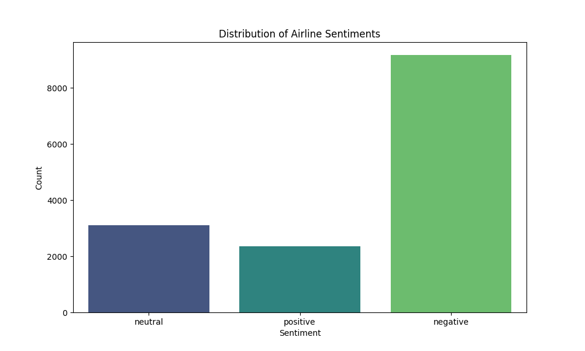
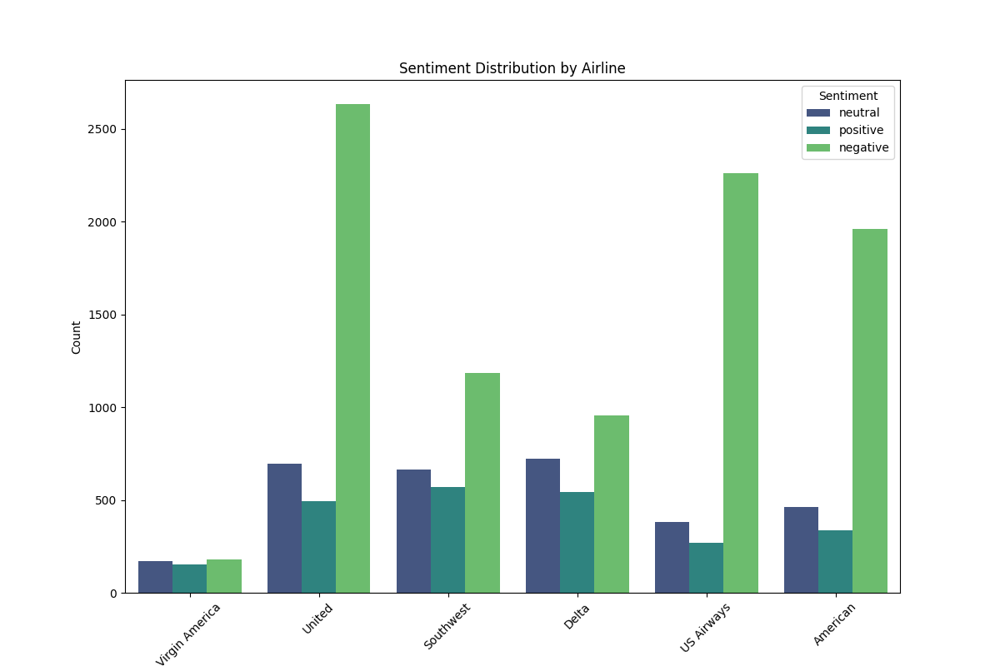
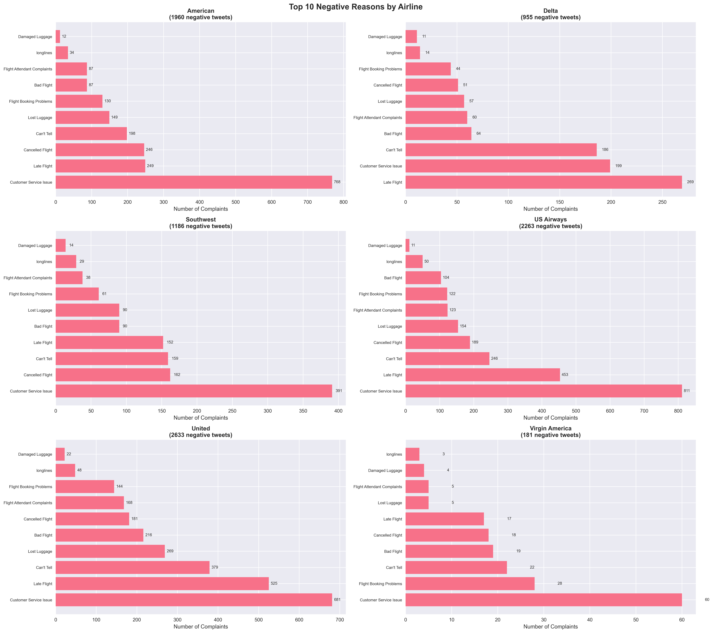

# Airline Sentiment Analysis Project

## Problem Statement
This project addresses sentiment analysis for airlines in America by analyzing Twitter data to understand customer opinions, identify pain points, and evaluate service quality across major U.S. airlines.

## Methodology
- **Data Source**: Twitter dataset (`Tweets.csv`) containing airline-related tweets with pre-labeled sentiments
- **Sentiment Analysis**: Utilizes TextBlob library for automated sentiment prediction based on text polarity (positive/negative/neutral)
- **Comparative Analysis**: Compares automated predictions with human-labeled sentiments to assess accuracy
- **Negative Feedback Deep Dive**: Categorizes and analyzes negative reasons by airline and frequency
- **Visualization**: Generates charts using Matplotlib and Seaborn for sentiment distribution, airline comparisons, and complaint patterns
- **Tools**: Python with pandas for data processing, TextBlob for NLP, and visualization libraries

## Key Findings
- **Sentiment Distribution**: Majority of tweets are negative (approximately 60-70%), with neutral and positive sentiments following
- **Accuracy**: TextBlob predictions show moderate accuracy compared to human labels (typically 60-70%)
- **Top Negative Reasons** (across all airlines):
  1. Customer Service Issue (most common complaint)
  2. Late Flight
  3. Can't Tell
  4. Lost Luggage
  5. Cancelled Flight
- **Airline-Specific Insights**: Different airlines have varying complaint profiles (e.g., some struggle more with delays, others with baggage)
- **Confidence Levels**: High confidence in identifying negative sentiments, enabling reliable complaint detection

## Visualizations

### Overall Sentiment Distribution


### Sentiment by Airline


### Top 10 Negative Reasons by Airline


### Overall Top 10 Negative Reasons


### Negative Reasons Comparison Across Airlines


### Negative Reason Distribution Heatmap


## Impact on Service Industry
This analysis provides actionable insights for airlines to:
- **Prioritize Improvements**: Focus resources on most common complaints like customer service and flight delays
- **Benchmark Performance**: Compare service quality across airlines to identify best practices
- **Proactive Service Enhancement**: Address specific pain points before they escalate
- **Customer Satisfaction**: Ultimately improve overall customer experience and loyalty in the competitive airline industry
- **Industry-Wide Benefits**: Demonstrates how sentiment analysis can drive service improvements across hospitality and transportation sectors

## Quick Start
```bash
pip install pandas textblob matplotlib seaborn
python sentiment_analysis.py
```
Open `dashboard.html` for interactive results or view generated PNG visualizations.

## Files
- `sentiment_analysis.py`: Main analysis script
- `negative_analysis.py`: Detailed negative feedback analysis
- `negative_visualizations.py`: Advanced visualization generation
- `dashboard.html`: Web-based results dashboard
- Generated visualizations: `sentiment_distribution.png`, `sentiment_by_airline.png`, etc.